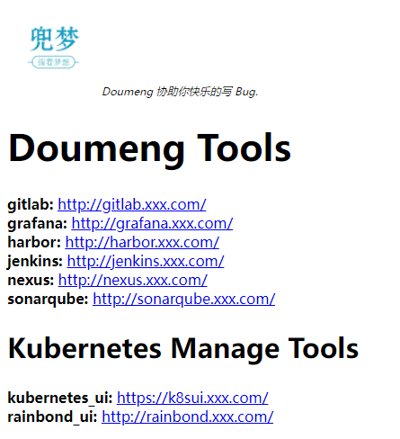

# README
- go gin default project
- project default URL: http://127.0.0.1:8080/

- Integrate its basic functions
```text
    1. config reload
    2. metrics
    3. BasicAuth
    4. build scripts
    5. docker / kubernetes deploy
```

- default URL path
```text
/check
    health status check
/-/reload
    reload config file
/metrics
/
    default page
/api/v1/
    BasicAuth page
```


### build/deploy
- build package
```
# 执行 go build, 并制作 images
bash cmd/linux_build.sh v0.2
```

- deploy
```
kubectl create namespace go
kubectl -n go create configmap go-default-service-configmap --from-file=configs/config.yaml
kubectl apply -f build/go_default_service-deploy.yaml
```

### demo
- initial page


